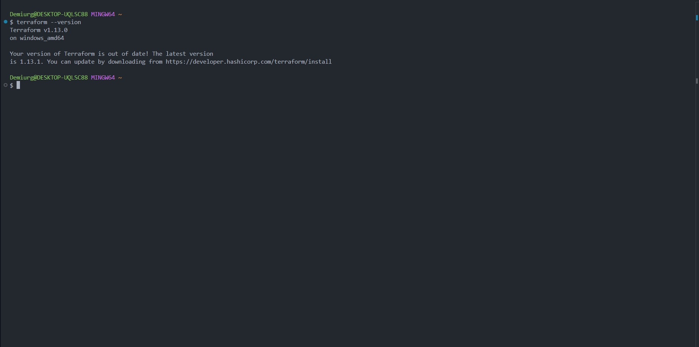
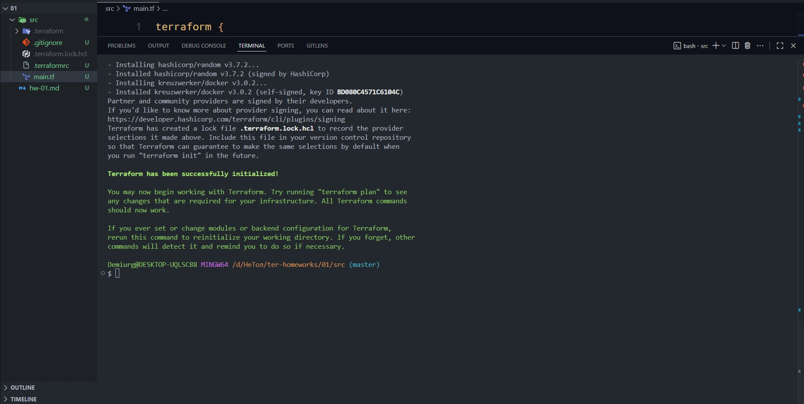
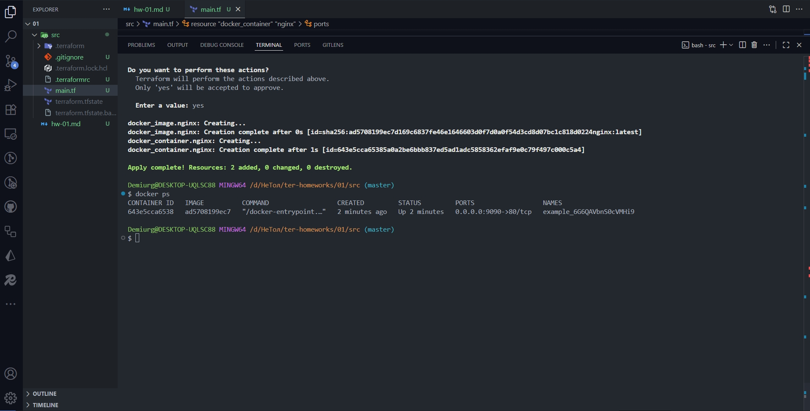
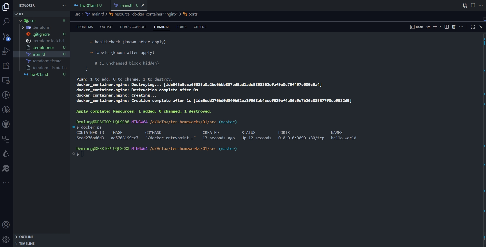
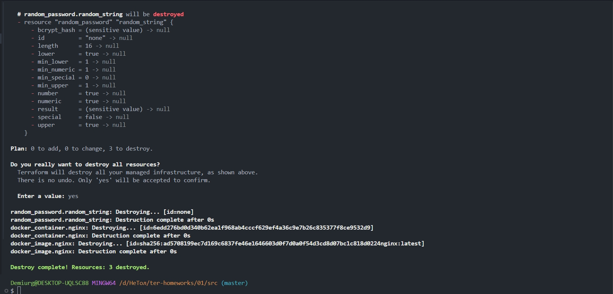
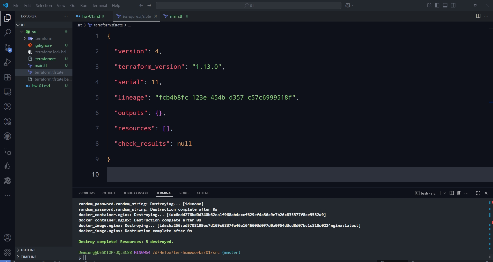

## Версия терраформ

## Задание 1

## Задание 2

personal.auto.tfvars

## Задание 3

"result": "6G6QAVbnS0cVMHi9"

## Задание 4

Ошибка_1: resource "docker_container" "1nginx" - имена ресурсов в Terraform должны начинаться с буквы или подчеркивания, не с цифры.

Ошибка_2: resource "docker_image" - отсутствует имя ресурса. У каждого ресурса должно быть имя. Синтаксис: resource "тип" "имя".

Ошибка_3: image = docker_image.nginx.image_id - ссылается на docker_image.nginx, но изначально ресурс не имел имени.

Ошибка_4: name = "example{random_password.random_string_FAKE.resulT}" - ресурс называется random_string, но ссылаемся на random_string_FAKE. Атрибут называется result, но написано resulT.

## Задание 5

## Задание 6

Опасность ключа -auto-approve:
Что делает этот ключ: Пропускает интерактивное подтверждение и сразу применяет изменения.
Опасности:

- Случайное удаление ресурсов - можешь не заметить, что Terraform собирается что-то удалить.
- Неожиданные изменения - применятся все изменения без возможности их проверить.
- Финансовые потери - в облачных провайдерах можешь случайно создать дорогие ресурсы.
- Потеря данных - можешь случайно пересоздать базы данных или хранилища.

Когда полезен:

- CI/CD пайплайны - автоматическое развертывание без человеческого вмешательства.
- Скрипты автоматизации - когда изменения уже проверены.
- Тестовые среды - где потеря данных не критична.

## Задание 7

## Задание 8

keep_locally = true
keep_locally (Boolean) If true, then the Docker image won't be deleted on destroy operation. If this is false, it will delete the image from the docker local storage on destroy operation.
