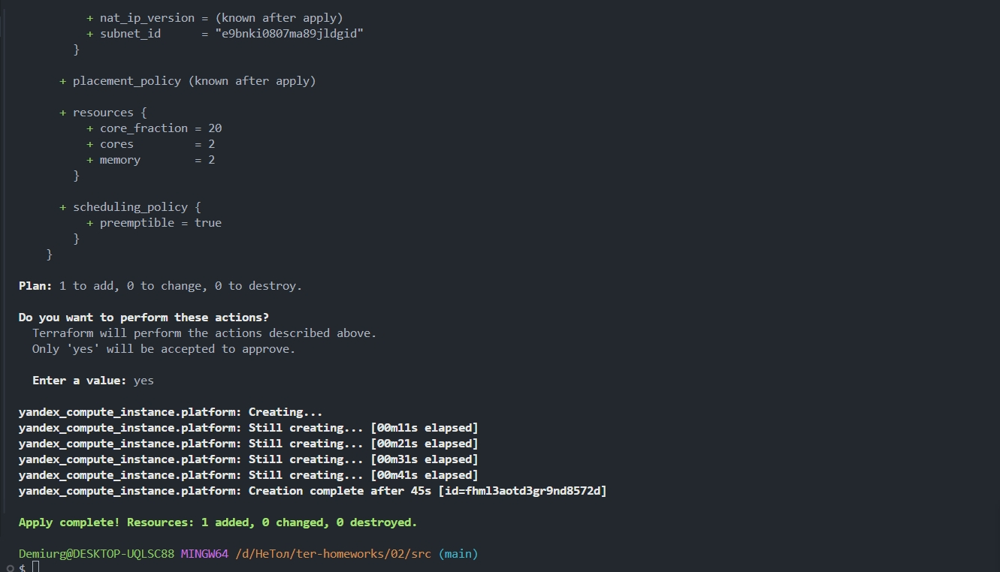
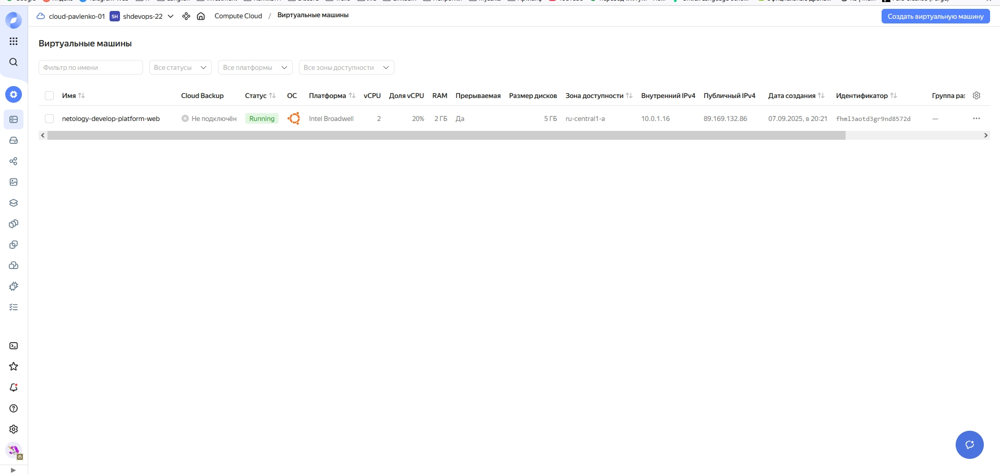
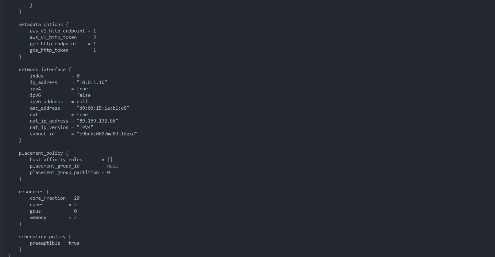
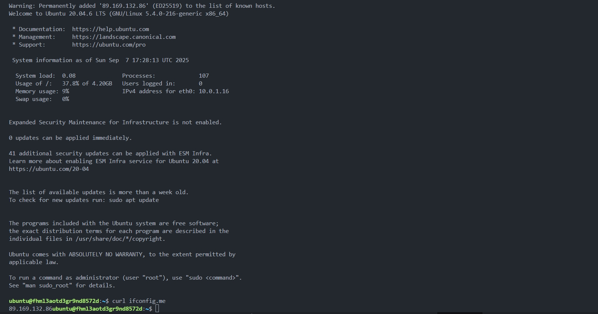
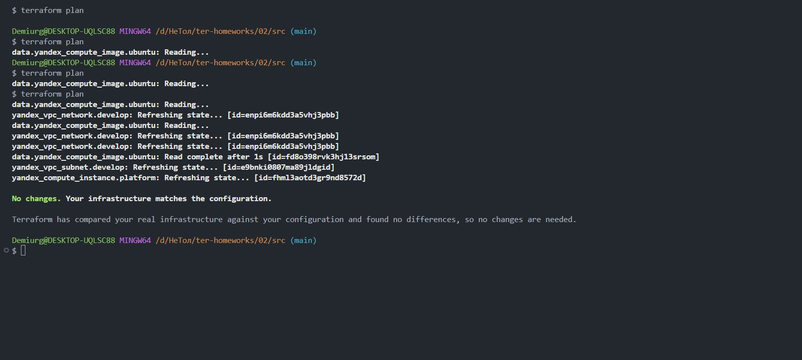
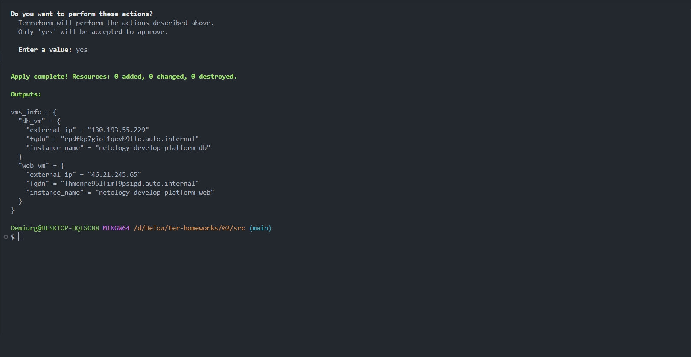
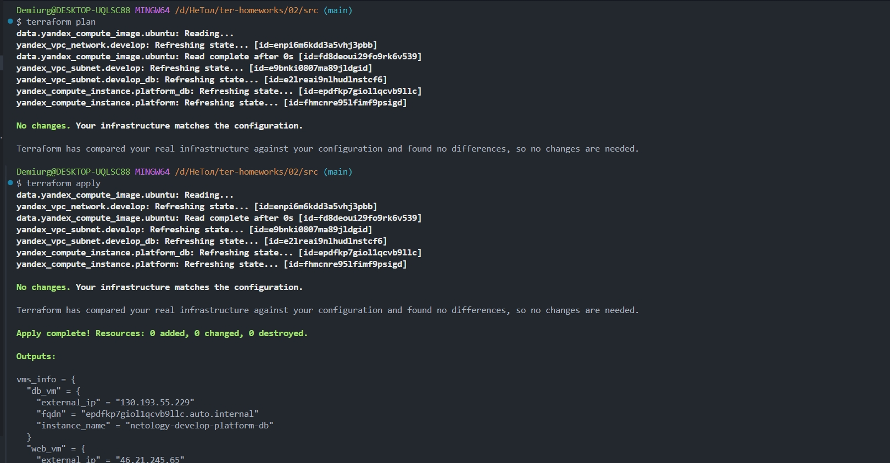
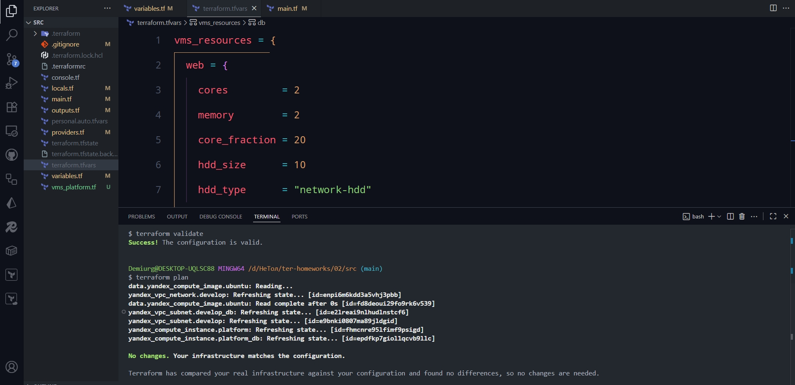

## Задание 1

Пункт 4:

- в platform_id указано standart v4 а нужно standard
- в параметрах ресурсов указаны слишком маленькие значения

Пункт 5:

Пункт 6:
В процессе обучения могут пригодиться параметры preemptible = true и core_fraction=5 в параметрах ВМ, так как первый делает ВМ прерываемой, а второй ставит гарантированную долю vCPU на самый низкий уровень, что существенно экономит средства.

## Задание 2

Пункт 3:

## Задание 3

## Задание 4

## Задание 5

## Задание 6

