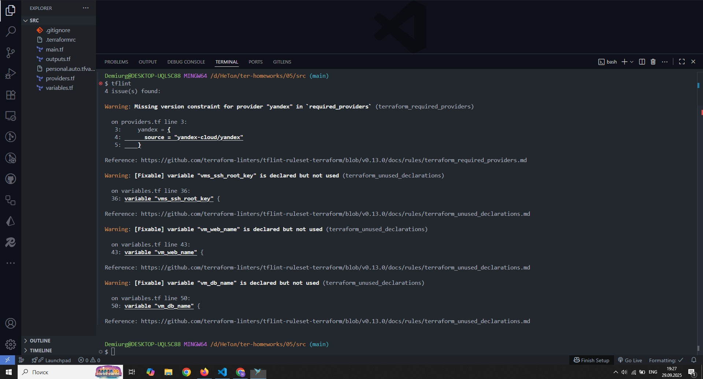
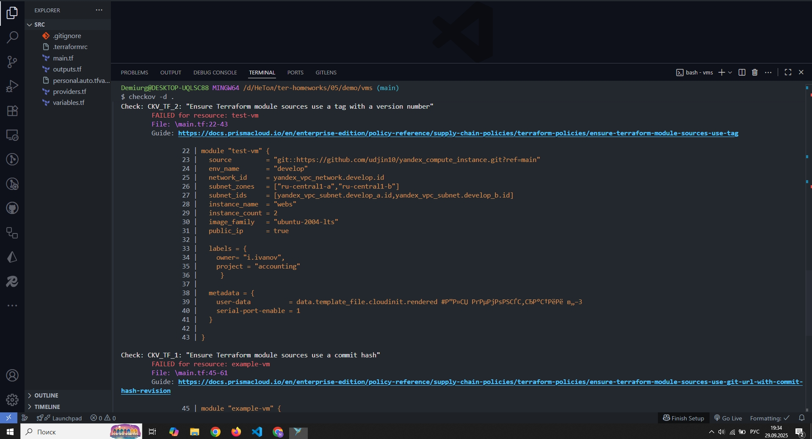
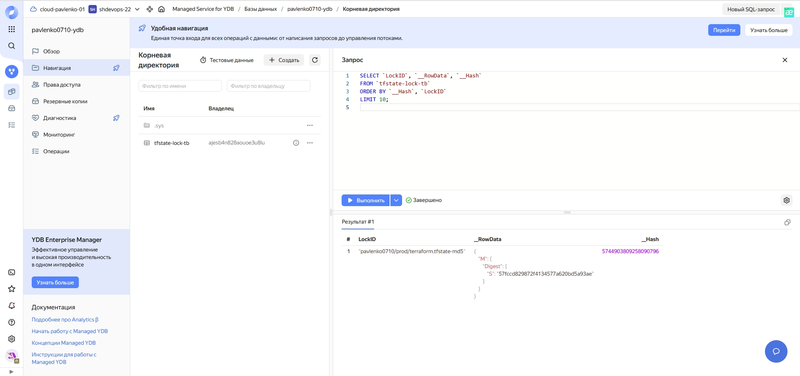
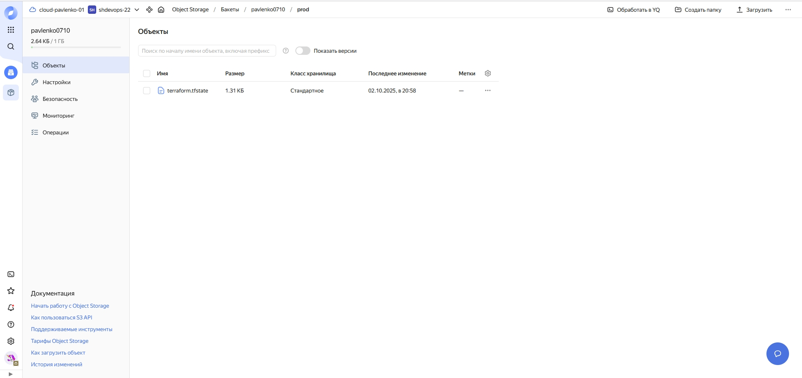
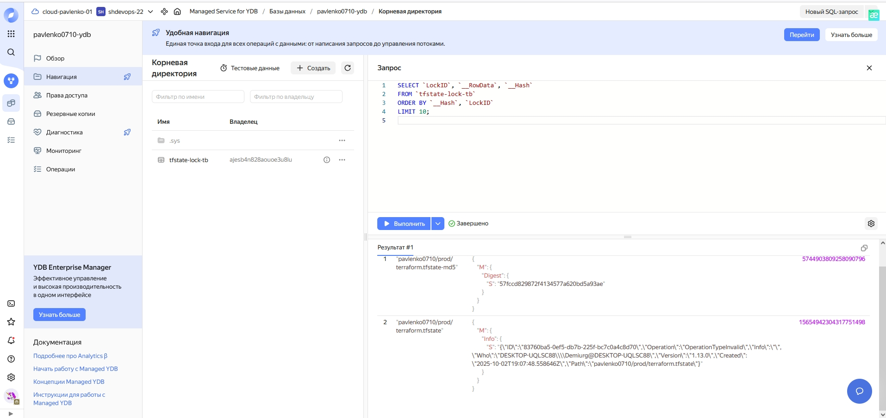
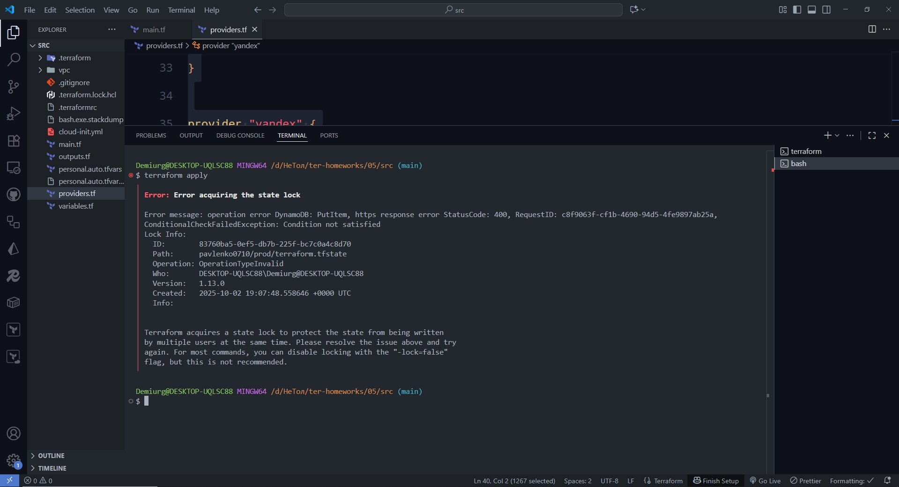
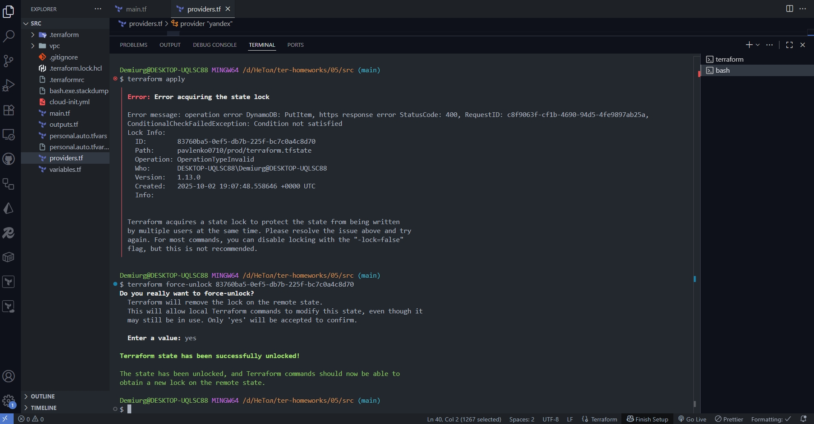
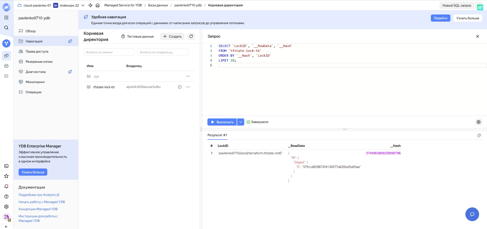
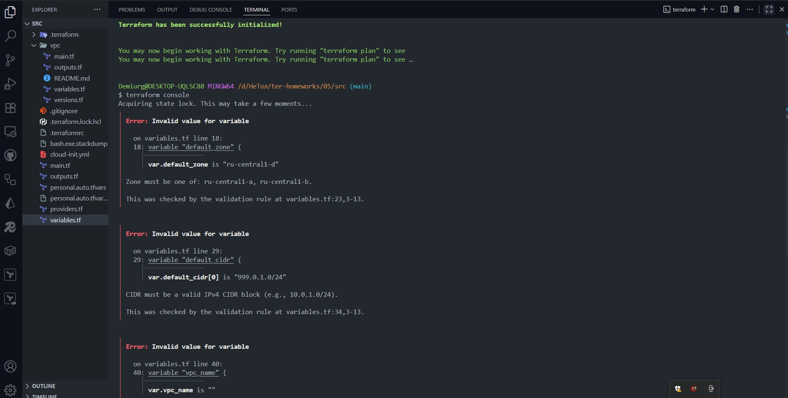

## Задание 1

- Предупреждения tflint связаны с отсутствием ограничений по версиям провайдеров и не используемыми переменными.
- Ошибки checkov также связаны с отсутствием ограничений по версиям модулей и провайдеров.

## Задание 2

## Задание 4

